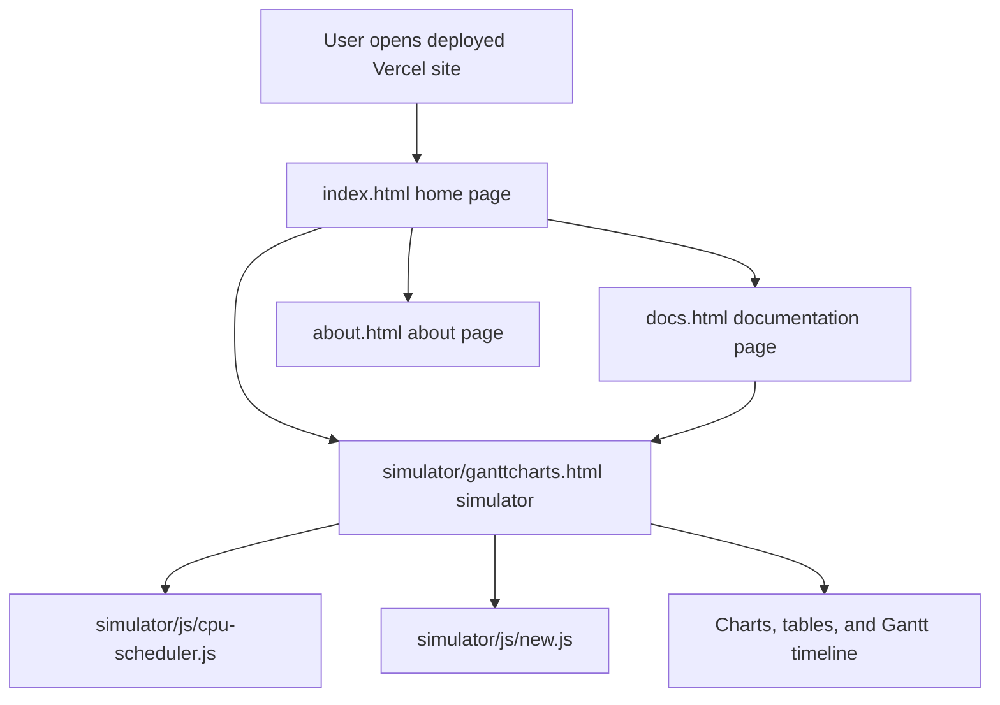

# CPU Scheduling Simulator Knowledge

This document explains the project in a detailed way so you can understand how the whole application is organized, how data flows through it, what each important term means, and how the deployed version works on Vercel.

## 1. Project Overview

This project is a browser-based CPU scheduling simulator built as a static web application. It is designed as an educational virtual lab for operating systems students. A user can enter process details such as arrival time, burst time, and priority, select a scheduling algorithm, and see the output in tables, charts, and a Gantt-style timeline.

The project is intentionally simple in deployment terms:

- There is no server-side code.
- There is no database.
- All logic runs in the browser using HTML, CSS, and JavaScript.
- Static assets such as images, stylesheets, and scripts are loaded directly by the pages.

Because of that, the project is a very good fit for Vercel static hosting.

## 2. High-Level Architecture

The architecture is a static front-end architecture with page-level routing handled by direct HTML files.

### Architecture style

- Presentation layer: HTML pages and CSS files.
- Interaction layer: JavaScript files that read form values, calculate scheduling results, and update the DOM.
- Visualization layer: Chart.js, Bootstrap UI components, MathJax formulas, and a progress-bar style Gantt view.

### Important design choice

The simulator does not rely on an API. Every calculation happens locally in the browser after the page loads.

## 3. Main Pages

### `index.html`

This is the landing page. It introduces the project as a CPU Scheduling Simulator and links to:

- the documentation page,
- the simulator,
- the about page.

It also includes short educational content and blog-style cards that point to operating-system concepts.

### `docs.html`

This page explains the theory behind CPU scheduling.

It covers:

- what CPU scheduling is,
- why scheduling is needed,
- important terminology,
- preemptive vs non-preemptive scheduling,
- the main algorithms supported by the simulator.

### `simulator/ganttcharts.html`

This is the core simulator page.

It contains:

- the process input table,
- algorithm selection controls,
- context switch and time quantum controls,
- a Run button and Reset button,
- output table,
- Gantt/progress visualization,
- pie charts for waiting time and turnaround time,
- explanation output generated after simulation.

### `about.html`

This is the team/about page. It mainly serves presentation purposes and does not affect the simulator logic.

## 4. Project Structure

Here is the practical meaning of the main folders and files.

### Root files

- `index.html` - homepage.
- `docs.html` - concept documentation.
- `about.html` - about/team page.
- `style.css` - shared site styling.
- `docs.css` - documentation page styling.
- `Knowledge.md` - this guide.

### `simulator/`

This folder holds the simulator UI and its logic.

- `simulator/ganttcharts.html` - simulator page.
- `simulator/css/bootstrap-simplex.css` - Bootstrap theme.
- `simulator/css/cpu-scheduler.css` - simulator-specific styles.
- `simulator/css/explanation.css` - explanation panel styles.
- `simulator/js/cpu-scheduler.js` - main scheduling engine used by the simulator page.
- `simulator/js/new.js` - an alternate/earlier scheduling script present in the repo.
- `simulator/js/bootstrap.min.js` - Bootstrap JS.
- `simulator/js/bootstrap-slider.js` - slider utility.
- `simulator/js/MathJaxSetup.js` - MathJax configuration.

### Asset folders

- `images/` - images used on the landing and docs pages.
- `eduford_img/` - profile and education-themed images.

## 5. How the Simulator Works

The simulator follows a simple browser-based pipeline.

### Step 1: User enters process data

On the simulator page, the user fills in:

- arrival time,
- burst time,
- priority,
- number of processes,
- context switch time,
- time quantum for Round Robin.

The table initially shows a few processes, and the plus/minus controls let the user adjust how many rows are active.

### Step 2: User chooses an algorithm

The algorithm dropdown supports the scheduling methods implemented in the project.

The interface updates algorithm-specific controls too:

- priority fields appear when Priority Scheduling is selected,
- time quantum is relevant for Round Robin,
- the explanation text changes depending on the chosen algorithm.

### Step 3: Run button triggers calculation

Clicking Run reads the table values and loads them into JavaScript arrays or process objects.

The code then:

- sorts or filters the processes based on the selected algorithm,
- computes completion time, waiting time, and turnaround time,
- calculates CPU utilization,
- builds the visual timeline,
- fills the output table,
- renders the pie charts,
- updates the explanation panel.

### Step 4: Results are rendered in the DOM

The page updates multiple output areas:

- output table,
- Gantt/progress bar,
- waiting time chart,
- turnaround time chart,
- CPU utilization value,
- average waiting time,
- average turnaround time,
- algorithm explanation section.

### Step 5: Reset clears the screen

The Reset button reloads the page so the user can try another configuration from scratch.

## 6. Internal Flow of the Main Script

The main scheduler logic lives in `simulator/js/cpu-scheduler.js`.

### Core data objects

The script uses small data containers to separate input data from output data.

#### Input-related data

The input data includes:

- process id,
- arrival time,
- burst time,
- priority,
- time quantum,
- selected algorithm.

#### Output-related data

The output data includes:

- process order,
- arrival times,
- burst times,
- completion times,
- turnaround times,
- waiting times,
- averages,
- CPU utilization.

### Scheduling flow

1. The page loads and the simulator initializes.
2. The script hides or shows algorithm-dependent UI pieces.
3. The process table values are read.
4. A process list is created.
5. The selected algorithm determines how the list is executed.
6. The script simulates CPU time progression.
7. Each process finishes and gets recorded in the output arrays.
8. The results are drawn back onto the page.

### Visualization flow

The simulator uses several visual layers:

- a progress bar style representation for execution order,
- a tabular summary for exact values,
- pie charts for per-process waiting and turnaround time,
- MathJax for formula rendering in the explanation area.

## 7. Meaning of the Main Terms

These are the key OS terms used in the project.

### Arrival Time

The time at which a process enters the ready queue and becomes available for execution.

### Burst Time

The total CPU time required by a process to complete.

### Completion Time

The exact time at which a process finishes execution.

### Turnaround Time

The total time taken by a process from arrival to completion.

Formula:

$$
Turnaround\ Time = Completion\ Time - Arrival\ Time
$$

### Waiting Time

The time a process spends waiting in the ready queue before getting CPU time.

Formula:

$$
Waiting\ Time = Turnaround\ Time - Burst\ Time
$$

### CPU Utilization

The percentage of total simulated time during which the CPU is doing useful work instead of being idle.

### Context Switch

The overhead time required to switch the CPU from one process to another.

### Time Quantum

The fixed time slice used in Round Robin scheduling.

### Ready Queue

The list of processes that are ready to run but are waiting for CPU access.

### Preemptive Scheduling

An algorithm where a running process can be interrupted and replaced by another process.

### Non-Preemptive Scheduling

An algorithm where a process keeps the CPU until it finishes or voluntarily releases it.

## 8. Algorithms in the Project

### FCFS

First Come First Serve executes processes in the order they arrive.

Why it matters:

- simple,
- easy to understand,
- good for learning the basics.

Weakness:

- can cause long waiting times for short processes.

### SJF

Shortest Job First selects the process with the smallest burst time next.

Why it matters:

- usually reduces average waiting time.

Weakness:

- longer jobs may starve if shorter jobs keep arriving.

### SRJF

Shortest Remaining Job First is the preemptive version of SJF.

Why it matters:

- the CPU can switch to a newly arrived shorter job.

Weakness:

- more context switching,
- more simulation complexity.

### Priority Scheduling

Processes are executed based on priority values.

In this project:

- a lower priority number means a higher scheduling priority.

Weakness:

- can cause starvation for lower-priority processes.

### Round Robin

Each process gets a fixed time quantum in cyclic order.

Why it matters:

- fair sharing of CPU time,
- suitable for time-sharing systems.

Weakness:

- too small a quantum increases overhead,
- too large a quantum behaves more like FCFS.

## 9. UI and Visualization Details

### Input table

The input table is the main user interaction surface. Each row represents one process.

### Algorithm dropdown

The dropdown switches the simulator between the supported scheduling strategies.

### Progress bar / Gantt representation

The progress bar shows the execution timeline visually. It may also show idle time and context-switch segments.

### Output table

The output table provides exact numeric results for each process.

### Charts

The charts make the results easier to compare across processes.

- Waiting time chart.
- Turnaround time chart.

### Explanation panel

The explanation area shows the input summary and algorithm reasoning in a readable format.

## 10. Deployment on Vercel

Since you have deployed the project on Vercel, the hosting model is straightforward.

### What Vercel is doing here

- Serving the static HTML files.
- Serving CSS, JavaScript, and image assets.
- Letting the browser run all simulator logic.

### Why this works well

- No server-side provisioning is needed.
- No database or API routes are required.
- The project loads quickly because the entire app is static.

### Important deployment note

Because the app uses relative links like `index.html`, `docs.html`, and `simulator/ganttcharts.html`, the folder structure must remain the same after deployment.

### Vercel-friendly behavior

- direct page navigation works well,
- asset paths should remain relative,
- all CDN-based libraries must be reachable by the browser.

## 11. Local Development Mental Model

Even if the project is live on Vercel, the local workflow is the same because the app is static.

1. Open the root folder in VS Code.
2. Open `index.html` or use Live Server.
3. Navigate to the simulator.
4. Test the algorithms in the browser.
5. Edit the HTML, CSS, or JavaScript files.
6. Refresh the browser and re-test.

## 12. What To Know Before Modifying the Project

If you plan to extend the project, keep these rules in mind.

- Keep relative paths consistent.
- Keep algorithm-specific UI logic synchronized with the selected algorithm.
- Make sure new process fields are reflected in both input handling and output rendering.
- Update the charts and explanation panel if you change the scheduling math.
- If you add new pages, link them from the navigation menus.

## 13. Practical Summary

This project is a teaching tool that demonstrates how CPU scheduling algorithms work through interaction and visualization.

At a high level:

- the user inputs process data,
- the browser script simulates scheduling,
- the page renders a timeline and metrics,
- the docs and homepage provide theory and navigation,
- Vercel hosts the static site without requiring server-side code.

If you remember one thing, remember this: the entire system is a client-side simulation, not a server-side application.